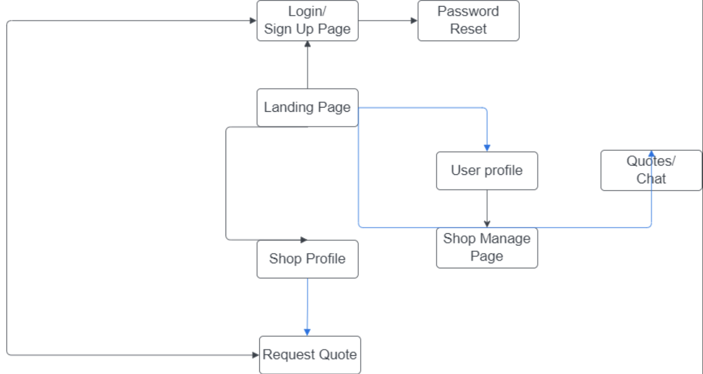

# How to run Sayaara locally

This project consists of two components: a front-end that is responsible for displaying the screens in a web browser, and a back-end that is responsible for handling API calls and hosting the database. To run Sayaara locally and have it work, you would need to run both components. NOTE: This app is no longer hosted on cloud as Heroku no longer offers free service, the following instructions are for running everything in localhost.

## Run Back-End

The back-end should be the first thing you start as the front-end will attempt to connect with the locally hosted server. \
The steps are listed below:\
`cd ../server`\
`node index.js` \
The expected output is **Server is running on port 8080**

## Run Front-End

Once the local server is up and running, you can run the front-end.\
The steps are listed below:\
`cd ../client`\
`npm run dev`\
This will then compile the front-end code. Please note that it takes quite a while for the webapp to finish compilation and display on your web browser. 

## Ensure the front-end is looking to connect to a local server
You can navigate to `client/src/services/config/config.json` to check that the front-end is looking for a local server. In this case, the file should have the content: \
`{
  "API_URL": "http://localhost:8080/api/"
}` 


# Deployment and running Sayaara locally

If at any point, the back-end is deployed on a cloud service, we can run the front-end locally while connecting to the remote hosted server with a few modifications.
- navigate to `client/src/services/config/config.json`
- replace the "API_URL" field with the remote API address
- save the file and run the front-end as instruted above

# Front-end Structure & Hierarchy
As part of our documentation, here we provide an overview of how the front-end is structured.\
All front-end files are stored inside the `client/src` directory.\
The directory is structured as below, with some brief overview for each entry.
```
src
|----assets/ (contains assets such as Sayaara logo images and mock data)
|
|----screens/ (contains the code for all visual aspects, utilizes functions provided by services)
|
|----services/ (front-end/API integration, contains code for making API requests)
|
|----shared/ (contains shared React resources/components such as error messages)
|
|----style/ (defines the main themes of the app such as color scheme, font, etc.)
|
|----App.tsx
|
|----AppRoutes.tsx (defines URL routes for each page)
|
|----constants.ts (useful constants)
|
|----index.tsx
|
|----interfaces.ts (contains interface definition for objects we are using)
|
|----react-app-env.d.ts
```

We will explain the most important subdirectories `screens/` and `services/` in detail. 
## screens/
This folder contains all the pages that comprise of the entire web app. \
The flow of the Sayaara web app is described by this diagram

Upon first opening the Sayaara site, the landing page is shown, displaying a list of shops. Users can then login/signup as a vehicle owner or a shop owner. As a vehicle owner, you can browse through all the displayed shops, add a vehicle to your profile, and request a quote for a service from the desired shops. Once a quote has been given by a shop, the vehicle owner then has the abilitiy to view the quote, accept the quote, and check on any updates to the quote. As a shop owner, you can modify the shop information, add services, and view all incoming quote requests. Once a quote is sent and accepted by a vehicle owner, the shop owner can modify the quote and provide updates. 

Next we will explain how each subdirectory in `screens/` contribute to this page flow.\
The subdirectory structure is shown below:
```
screens
|----auth/
|----landing/
|----profile/
|----request/
|----shop/
|----shop-landing/
```
- **auth**\
    This subdirectory contains the pages for login, signup, and password reset.\
    Signing up and signing in uses the functions in `services/useAuthService.ts` to call the API and either create new users, or validate and return an existing user.\
    Upon successful login, the user is stored in this session and the relevant information will be displayed (e.g. different pages for vehicle owner and shope owner).
- **landing**\
    This subdirectory contains all the components that make up the main landing page (the first page anyone sees when launching the web app).\
    It is made up of 3 components: A navigation bar at the top of the screen, a side bar for filtering shops at the left side of the screen, and a list view of cards for each shop. Each component is represented accordingly in each file.\
    Loading the landing page utilizes the functions in `services/useShopService.ts` to fetch all shops. 
- **profile**\
    This subdirectory contains all the components that make up the profile page for both vehicle owners and shop owners. 
